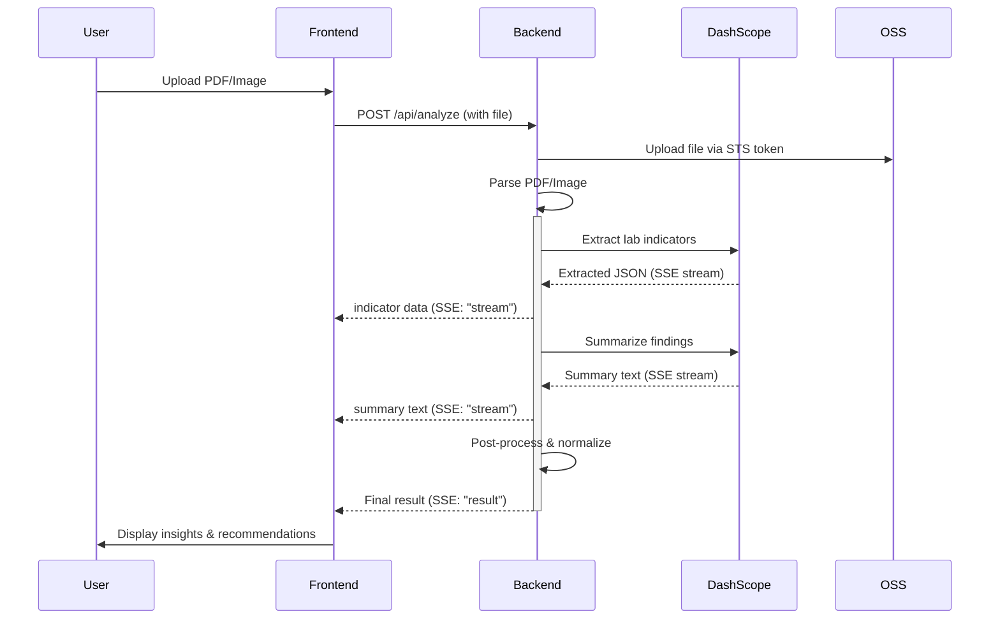

# ClinicLens

AI-powered clinical lab analysis platform built with Next.js, Express.js, and Alibaba Cloud services.

## Overview

ClinicLens enables healthcare professionals to upload lab reports (PDF/images), automatically extract lab indicators, stream AI-powered analysis, and receive clinical follow-up insights leveraging Alibaba Cloud DashScope Qwen models.

## Tech Stack

### Frontend

- **Framework**: Next.js 14.2 + React 18.3
- **Styling**: Tailwind CSS 4.2
- **Language**: TypeScript 5.8
- **Icons**: lucide-react 0.408
- **Upload**: Alibaba Cloud OSS + STS tokens

### Backend

- **Runtime**: Node.js 20 (Alpine)
- **Framework**: Express 4.19
- **Language**: JavaScript
- **AI Models**: Alibaba DashScope Qwen (extract, summarize, chat)
- **Storage**: Alibaba OSS, local file system
- **Features**: PDF analysis, SSE streaming, STS/OSS integration

### Cloud

- **Provider**: Alibaba Cloud
- **Services**: DashScope (AI models), OSS (object storage), STS (secure tokens)
- **Deployment**: Render (backend), Vercel (frontend)

## Architecture

```
┌─────────────┐         ┌─────────────────┐
│   Browser   │◄────────│  Next.js UI     │
│  (ClinicLens)         │  (React + TS)   │
└──────┬──────┘         └────────┬────────┘
       │                         │
       │ SSE / JSON              │ Upload + API calls
       │                         │
       └─────────────────────────┼─────────────────────────────────────┐
                                 │                                     │
                    ┌────────────▼──────────────────┐                 │
                    │   Express.js Backend         │                 │
                    │  - PDF Parser (Python)       │◄────────────────┘
                    │  - AI Orchestration          │
                    │  - SSE Streaming             │
                    └────────────┬─────────────────┘
                                 │
                ┌────────────────┼────────────────┐
                │                │                │
         ┌──────▼─────┐  ┌──────▼──────┐  ┌─────▼────────┐
         │ DashScope   │  │  OSS        │  │  Local Data  │
         │ Qwen Models │  │  Storage    │  │  Files       │
         │             │  │             │  │              │
         │ • Extract   │  │ • Upload    │  │ • History    │
         │ • Summarize │  │ • Retrieve  │  │ • Analytics  │
         │ • Chat      │  │             │  │              │
         └─────────────┘  └─────────────┘  └──────────────┘
```

## Data Pipeline



## Setup

### Prerequisites

- Node.js 20+
- npm or yarn
- Alibaba Cloud credentials (ALI_ACCESS_KEY, ALI_SECRET_KEY, ALI_ROLE_ARN)
- DashScope API key (DASHSCOPE_API_KEY)

### Local Development

**1. Install dependencies:**

```bash
cd frontend && npm install
cd ../backend && npm install
```

**2. Configure environment variables:**
Create `.env` in the repository root:

```env
ALI_ACCESS_KEY=your_access_key
ALI_SECRET_KEY=your_secret_key
ALI_ROLE_ARN=arn:the-role
OSS_REGION=oss-cn-hangzhou
OSS_BUCKET_NAME=your_bucket
DASHSCOPE_API_KEY=your_api_key
```

**3. Run the backend:**

Open a terminal in the project root and start the API server:

```bash
cd backend
npm start
```

Backend runs on `http://localhost:9000`

**4. Run the frontend:**

Open a second terminal and start the web app:

```bash
cd frontend
npm run dev
```

Frontend runs on `http://localhost:3000`

If you want to use a different port for the frontend, pass it explicitly:

```bash
cd frontend
npm run dev -- --port 5174
```

## API Endpoints

| Method | Endpoint | Description |
|--------|----------|-------------|
| `GET` | `/health` | Backend health check |
| `POST` | `/api/analyze` | Upload and analyze lab report (SSE) |
| `POST` | `/api/chat` | Chat about analysis results (SSE) |
| `GET` | `/api/analyses` | Fetch analysis history |
| `POST` | `/api/indicator-explanation` | Get explanation for specific indicator |
| `GET` | `/api/sts-token` | Get STS token for direct OSS upload |
| `GET` | `/api/sign-url` | Get signed URL for OSS file retrieval |

## File Structure

```
├── frontend/                    # Next.js UI
│   ├── app/                     # Pages and layouts
│   ├── components/              # React components
│   └── lib/                     # Utilities (API, types, OSS)
├── backend/                     # Express API
│   ├── server.js                # Main server and routes
│   ├── analysis_runtime.js      # Data normalization
│   ├── analysis_runner.js       # Analysis orchestration
│   ├── prompts/                 # AI system prompts
│   └── data/                    # History files
├── render.yaml                  # Render Blueprint config
└── docker-compose.yml           # Local orchestration
```

## Design System

- **Font**: Cabinet Grotesk (UI), Geist Mono (metrics)
- **Accent**: Teal `#0d9488`
- **Base**: Cream `#faf8f3`
- **Typography**: Responsive clamping with gradient text effects

## Lab Indicators

Supported organs and indicators:

- **Kidneys**: Creatinine, BUN, Urinalysis
- **Liver**: ALT, AST, Bilirubin
- **Heart**: Troponin, BNP
- **Lungs**: SpO₂, PaCO₂
- **Blood**: RBC, WBC, Platelets
- **Pancreas**: Amylase, Lipase
- **Thyroid**: TSH, T3, T4
- **Bone**: Calcium, Phosphate
- **Immune**: Lymphocytes, Neutrophils
- **Other**: General chemistry, coagulation

## Testing

```bash
# Backend smoke test
./test-backend.sh http://localhost:9000

# Analysis pipeline test
cd backend && npm run analysis:test

# Chat feature test
cd backend && npm run chat:test
```

## Performance & Constraints

- Max file size: 50MB (configurable)
- PDF parsing timeout: 60s
- Model inference: 30-120s depending on report complexity
- Free tier cold start: ~30s on Render
- Data persistence: Local file system (backend/data/)

## Notes

- **Browser tab title**: "ClinicLens — AI-powered clinical lab insights"
- **Favicon**: Monogram search icon with teal gradient
- **Styling**: CSR with Tailwind, no CSS-in-JS
- **Caching**: Browser cache may delay favicon updates (hard refresh required)

## License

MIT

---

**Last updated**: April 2026
**Status**: Production-ready for free-tier cloud deployment
