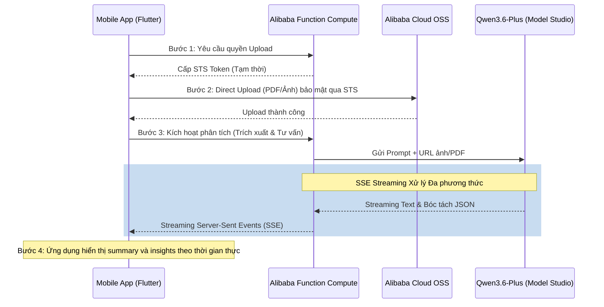

# Smart Labs Analyzer (Qwen AI Build Day 2026)

Dự án phát triển nền tảng phân tích kết quả xét nghiệm y khoa thông minh theo hướng text-first, được thiết kế đặc biệt cho giải đấu **Qwen AI Build Day 2026**.

Dự án tận dụng sức mạnh đa phương thức của mô hình **Qwen3.6-Plus** kết hợp vùng không gian điện toán toàn diện của hệ sinh thái **Alibaba Cloud** để đem lại trải nghiệm mượt mà, bảo mật và chính xác cho bệnh nhân/người dùng đầu cuối.

---

## 🏗️ 1. Kiến Trúc Hệ Thống (System Architecture)



---

## 🛠️ 2. Tech Stack (Công nghệ cốt lõi)

### AI Brain & Platform

* **LLM Core:** `Qwen3.6-Plus` (Alibaba Model Studio) - Xử lý đa phương thức, tự động đọc ảnh/PDF bảng biểu xét nghiệm và đưa ra lời khuyên mà không cần OCR trung gian. Chạy trên context 1M token.
* **Storage:** `Alibaba Cloud OSS` - Lưu trữ file người dùng bảo mật, hỗ trợ private URL và Direct Upload.
* **Backend logic:** `Alibaba Function Compute` (Serverless Node.js/Python) - Đóng vai trò làm Proxy kết nối AI và cấp quyền, tối ưu chi phí (chỉ tính tiền khi chạy hàm).

### Client App

* **Frontend Framework:** `Flutter` (iOS / Android)
* **Result Experience:** Tập trung vào summary card, bảng chỉ số và history panel để người dùng đọc kết quả nhanh và rõ ràng.

---

## 🔄 3. Dữ Liệu Đầu Ra Chuẩn Hóa (Data Contract)

Qwen3.6-Plus được thiết lập hệ thống prompting khắt khe nhằm đảm bảo đầu ra luôn là chuẩn **JSON Array** và phù hợp để render trực tiếp lên UI panel.

**Ví dụ một JSON Output trả về từ Qwen khi phân tích file Gan & Thận:**

```json
{
  "status": "success",
  "patient_name": "Nguyen Van A",
  "analysis_date": "2026-04-13",
  "results": [
    {
      "indicator_name": "Creatinine",
      "value": "1.8",
      "unit": "mg/dL",
      "reference_range": "0.7 - 1.2",
      "organ_id": "kidneys",
      "severity": "abnormal_high",
      "patient_advice": "Chỉ số Creatinine của bạn đang cao hơn mức bình thường, cho thấy chức năng lọc của thận có thể đang bị quá tải. Bạn nên uống nhiều nước lọc hơn, giảm ăn thịt đỏ và đi khám chuyên khoa thận nội tiết sơm."
    },
    {
      "indicator_name": "AST (SGOT)",
      "value": "25",
      "unit": "U/L",
      "reference_range": "< 40",
      "organ_id": "liver",
      "severity": "normal",
      "patient_advice": "Men gan ở mức an toàn. Hãy tiếp tục duy trì chế độ sinh hoạt và ăn uống lành mạnh hiện tại."
    }
  ]
}
```

*(App Flutter dùng `organ_id` và `severity` để nhóm mức độ cảnh báo trong summary/results panel.)*

---

## 🔒 4. Tiêu Điểm Kỹ Thuật Cho Hackathon (Hackathon Edge)

Để gây ấn tượng với ban giám khảo, hệ thống đã giải quyết 3 bài toán lớn của ngành Y tế Điện tử:

1. **🏥 Privacy & Security Compliance:** Không đưa đường dẫn file Public. Áp dụng quy trình cấp phát **STS (Security Token Service)** để ứng dụng di động đẩy file thẳng lên bucket Private trên OSS. Máy chủ chỉ giải mã khi cần thiết.
2. **⚡ Real-time Latency (Trải nghiệm liền mạch):** Không bắt người dùng nhìn màn hình "Loading" 15 giây. Kết hợp thiết kế **SSE (Server-Sent Events) Streaming**, Qwen sẽ đẩy từng chữ giải thích về điện thoại theo thời gian thực như đang chat, làm hiệu ứng giao diện mượt mà và cảm giác "AI đang sống".
3. **🇻🇳 Hyper-Localization (Địa phương hóa trọn vẹn):** Khai thác năng lực đa ngôn ngữ thế hệ mới của Qwen. Hệ thống có khả năng đọc các tờ xét nghiệm ghi song ngữ hoặc tiếng Việt gõ tắt (phổ biến tại VN), đồng thời output lời khuyên bằng văn phong cực kỳ tự nhiên, phù hợp với thói quen ăn uống của người Việt.

---

## 🚀 5. Lộ Trình Phát Triển (Next Steps)

* [ ] Khởi tạo dự án Flutter và hoàn thiện bộ summary/results/history panel.
* [ ] Thiết lập tài khoản Alibaba Cloud: Tạo OSS Bucket, setup IAM Policy & Role cho STS Token.
* [ ] Code Serverless bằng Function Compute (API lấy STS và API Call Qwen Studio).
* [ ] Tối ưu System Prompting (Thử nghiệm Few-shot Prompt) cho mô hình Qwen3.6-Plus.
* [ ] Tích hợp Luồng giao diện toàn vẹn (Upload -> Streaming Response -> Summary + Results).
