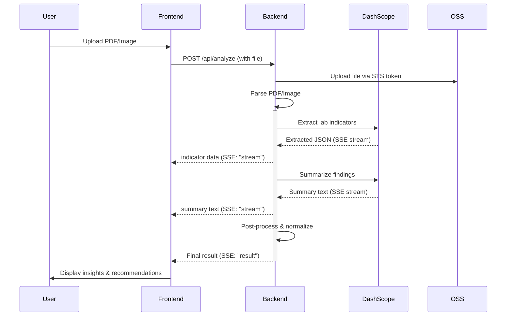

# ClinicLens

AI-powered clinical lab analysis platform built with Next.js, Express.js, and Alibaba Cloud services.

## Overview

ClinicLens enables healthcare professionals to upload lab reports (PDF/images), automatically extract lab indicators, stream AI-powered analysis, and receive clinical follow-up insights leveraging Alibaba Cloud DashScope Qwen models.

## Tech Stack

### Frontend

- **Framework**: Next.js 14.2 + React 18.3
- **Styling**: Tailwind CSS 4.2
- **Language**: TypeScript 5.8
- **Icons**: lucide-react 0.408
- **Upload**: Alibaba Cloud OSS + STS tokens

### Backend

- **Runtime**: Node.js 20 (Alpine)
- **Framework**: Express 4.19
- **Language**: JavaScript
- **AI Models**: Alibaba DashScope Qwen (extract, summarize, chat)
- **Storage**: Alibaba OSS, local file system
- **Features**: PDF analysis, SSE streaming, STS/OSS integration

### Cloud

- **Provider**: Alibaba Cloud
- **Services**: DashScope (AI models), OSS (object storage), STS (secure tokens)
- **Deployment**: Render (backend), Vercel (frontend)

## Architecture

```
┌─────────────┐         ┌─────────────────┐
│   Browser   │◄────────│  Next.js UI     │
│  (ClinicLens)         │  (React + TS)   │
└──────┬──────┘         └────────┬────────┘
       │                         │
       │ SSE / JSON              │ Upload + API calls
       │                         │
       └─────────────────────────┼─────────────────────────────────────┐
                                 │                                     │
                    ┌────────────▼──────────────────┐                 │
                    │   Express.js Backend         │                 │
                    │  - PDF Parser (Python)       │◄────────────────┘
                    │  - AI Orchestration          │
                    │  - SSE Streaming             │
                    └────────────┬─────────────────┘
                                 │
                ┌────────────────┼────────────────┐
                │                │                │
         ┌──────▼─────┐  ┌──────▼──────┐  ┌─────▼────────┐
         │ DashScope   │  │  OSS        │  │  Local Data  │
         │ Qwen Models │  │  Storage    │  │  Files       │
         │             │  │             │  │              │
         │ • Extract   │  │ • Upload    │  │ • History    │
         │ • Summarize │  │ • Retrieve  │  │ • Analytics  │
         │ • Chat      │  │             │  │              │
         └─────────────┘  └─────────────┘  └──────────────┘
```

## Data Pipeline



## Reproduce Locally

### Prerequisites

- Node.js 20+
- npm 10+
- Python 3.10+ (required by backend PDF analysis scripts)
- Alibaba Cloud credentials (ALI_ACCESS_KEY, ALI_SECRET_KEY, ALI_ROLE_ARN)
- DashScope API key (DASHSCOPE_API_KEY)

### 1. Clone and install dependencies

```bash
git clone <your-fork-or-repo-url>
cd qwen_build_day

cd backend && npm install
cd ../frontend && npm install
```

### 1.1 Create Python virtual environment (recommended)

```bash
python3 -m venv backend/.venv
source backend/.venv/bin/activate
pip install -r backend/requirements.txt
```

If you do not use venv, install the same requirements into your current Python environment.

### 2. Configure environment variables

Copy [.env.example](.env.example) to .env at repository root and fill real values:

```bash
cp .env.example .env
```

Required keys:

- ALI_ACCESS_KEY
- ALI_SECRET_KEY
- ALI_ROLE_ARN
- OSS_REGION
- OSS_BUCKET_NAME
- DASHSCOPE_API_KEY

Optional runtime keys:

- PORT (default: 9000)
- DASHSCOPE_MODEL
- DASHSCOPE_EXTRACT_MODEL
- DASHSCOPE_SUMMARY_MODEL
- DASHSCOPE_CHAT_MODEL
- DASHSCOPE_INDICATOR_MODEL

Backend env lookup order is root .env first, then backend/.env.

### 3. Start backend (Terminal A)

```bash
cd backend
PORT=9000 npm start
```

Expected log includes server listening on port 9000.

### 4. Start frontend (Terminal B)

```bash
cd frontend
npm run dev
```

Open <http://localhost:3000>.

### 5. Smoke checks

Backend health:

```bash
curl -sS http://127.0.0.1:9000/health
```

Frontend production build:

```bash
cd frontend
npm run build
```

### 6. Optional backend validation scripts

```bash
cd backend
npm run analysis:test
npm run chat:smoke
npm run chat:test
```

### Linux quick start

```bash
chmod +x ./scripts/start-local.sh
./scripts/start-local.sh
```

The Linux script auto-creates backend/.venv and installs backend/requirements.txt into it.

### Windows quick start

PowerShell (recommended, includes backend .venv setup):

```powershell
powershell -ExecutionPolicy Bypass -File .\scripts\start-local.ps1
```

Batch alternative:

```bat
scripts\start-local.bat
```

### Troubleshooting

- Warning about vm2 coffee-script during frontend build:
  - Symptom: Module not found: Can't resolve coffee-script in vm2/lib/compiler.js
  - Cause: transitive dependency chain from ali-oss -> urllib -> proxy-agent -> pac-resolver -> degenerator -> vm2 references optional CoffeeScript parser.
  - Impact: usually warning-only; build can still complete.
- Backend warns missing environment variables:
  - Ensure required keys are present in root .env.
- Upload succeeds but analysis fails:
  - Verify OSS region format like oss-cn-hangzhou and bucket permissions.
  - Verify Python deps are installed from [backend/requirements.txt](backend/requirements.txt).

## API Endpoints

| Method | Endpoint | Description |
|--------|----------|-------------|
| `GET` | `/health` | Backend health check |
| `POST` | `/api/analyze` | Upload and analyze lab report (SSE) |
| `POST` | `/api/chat` | Chat about analysis results (SSE) |
| `GET` | `/api/analyses` | Fetch analysis history |
| `POST` | `/api/indicator-explanation` | Get explanation for specific indicator |
| `GET` | `/api/sts-token` | Get STS token for direct OSS upload |
| `GET` | `/api/sign-url` | Get signed URL for OSS file retrieval |

## File Structure

```
├── frontend/                    # Next.js UI
│   ├── app/                     # Pages and layouts
│   ├── components/              # React components
│   └── lib/                     # Utilities (API, types, OSS)
├── backend/                     # Express API
│   ├── server.js                # Main server and routes
│   ├── analysis_runtime.js      # Data normalization
│   ├── analysis_runner.js       # Analysis orchestration
│   ├── prompts/                 # AI system prompts
│   └── data/                    # History files
├── render.yaml                  # Render Blueprint config
└── scripts/                     # Local launcher scripts
  ├── start-local.sh           # Linux local launcher
  ├── start-local.ps1          # Windows PowerShell launcher
  └── start-local.bat          # Windows batch launcher
```

## Design System

- **Font**: Cabinet Grotesk (UI), Geist Mono (metrics)
- **Accent**: Teal `#0d9488`
- **Base**: Cream `#faf8f3`
- **Typography**: Responsive clamping with gradient text effects

## Lab Indicators

Supported organs and indicators:

- **Kidneys**: Creatinine, BUN, Urinalysis
- **Liver**: ALT, AST, Bilirubin
- **Heart**: Troponin, BNP
- **Lungs**: SpO₂, PaCO₂
- **Blood**: RBC, WBC, Platelets
- **Pancreas**: Amylase, Lipase
- **Thyroid**: TSH, T3, T4
- **Bone**: Calcium, Phosphate
- **Immune**: Lymphocytes, Neutrophils
- **Other**: General chemistry, coagulation

## Testing

```bash
cd backend
npm run analysis:test
npm run chat:smoke
npm run chat:test
```

## Performance & Constraints

- Max file size: 50MB (configurable)
- PDF parsing timeout: 60s
- Model inference: 30-120s depending on report complexity
- Free tier cold start: ~30s on Render
- Data persistence: Local file system (backend/data/)

## Notes

- **Browser tab title**: "ClinicLens — AI-powered clinical lab insights"
- **Favicon**: Monogram search icon with teal gradient
- **Styling**: CSR with Tailwind, no CSS-in-JS
- **Caching**: Browser cache may delay favicon updates (hard refresh required)

## License

MIT

---

**Last updated**: April 2026
**Status**: Production-ready for free-tier cloud deployment
